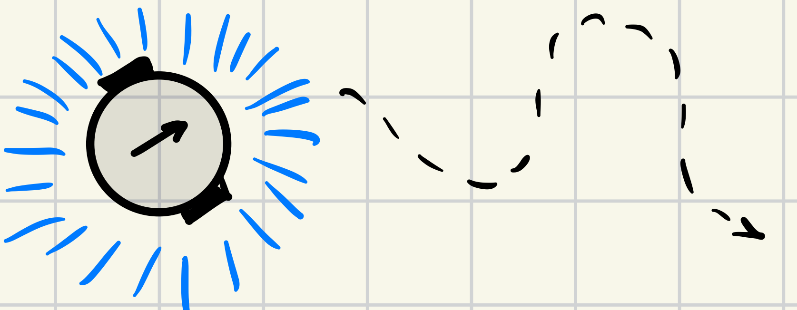
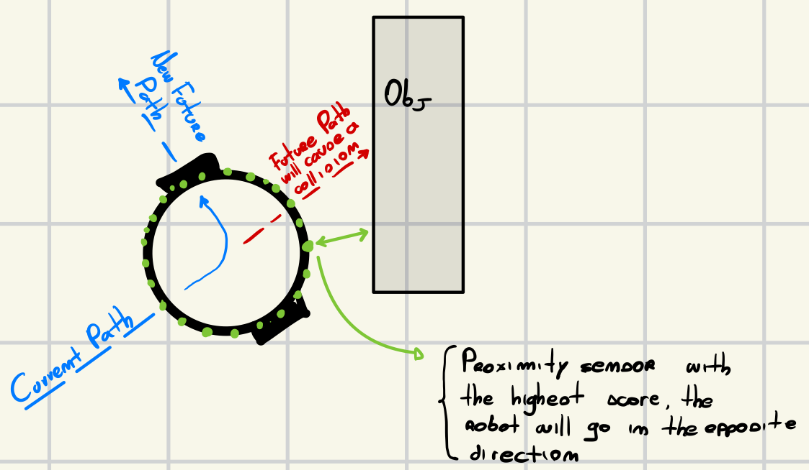

# Collision Avoidance Task
This task required the goal of *random walking* while *avoding* the obstacles that were present in the arena. The robot does not have a specific task to do, so It has not a final destination to reach, It just
wants to walk freely in the arena and in the meantime avoid all the obstacles that are present along Its journey.
## Design
In order to achieve the desired goal of the task, I have divided the two logics into two different and separated files:
1. *move_random_logic*: inside this file I have developed the entire logic for the *random walking*;
2. *avoid_logic*: the content of this file represent the logic for *avoiding* the different obstacles that are present in the arena.

The robot always checks if it is possible to randomly walk, because if the *footbot* detects an obstacle, the first thing that It will try to do will be to avoid It with a logic that will be further described.
So, in case there are no obstacles in front or around the robot, the random walk can be executed without worrying about colliding with an obstacle.

### Random walk
For what concernes the random walking of the robot, the function that has to create this behaviour uses the *footbot random module*. More precisely, the *uniform* method for automatically generate two different values inside the interval [0, 15]. Then both of this two values, are set as velocities for the two wheels.



```lua
function moverandommodule.move(robot)
	log("robot: Priority over move random task")
	local left_v = robot.random.uniform(0, generalmodule.MAX_VELOCITY)
	local right_v = robot.random.uniform(0, generalmodule.MAX_VELOCITY)
	robot.wheels.set_velocity(left_v, right_v)
end
```


### Collision Avoidance
The most important task that the robot has to do, is the collision avoidance. In order to achieve this behaviour is good to know that the robot is equipped with 24 proximity sensors, that can detect an obstacle up to 10cm from the robot itself. Each sensor returns two different values:

1. *value*: the detected value of the sensor, in this case is the distance from the object;
2. *angle*: the sensor's angle in radiant.



Given this two information, the main idea was to execute a linear scan over all the 24 sensors, and get the maximum value detected from this sensors and also its angle.

```lua
function find_nearest_object(robot)
	local nearest_object = 0.0 -- nearest distance from the closest object
	local proximity_angle = 0.0 -- sensor's angle

	for i = 1, #robot.proximity do
		local object_distance = robot.proximity[i].value
		if object_distance > nearest_object then
			nearest_object = object_distance
			proximity_angle = robot.proximity[i].angle
		end
	end
	ANGLE = proximity_angle
	return nearest_object
end
```

Then the returned value is compared with a fixed threshold, in this case the robot can avoid noise problems. The logic for checking the obstacle distance is pretty straigthforward, it just compare it with the threshold and if it is greather than it, it means that there is an obstacle and we need to avoid it.

```lua
function avoid_object_step(robot)
	local nearest_object = find_nearest_object(robot)
	-- NOTE: If the detected object is close (by confronting the distance with the THR), then we try to avoid the object.
	if nearest_object >= OBJECT_THRESHOLD then
		return direction_module.DETECTED
	else
		robot.leds.set_all_colors("black")
		return direction_module.SAFE
	end
end
```

The angle is important because it guides the robot in which direction it has to go in order to avoid the obstacle. The angles are managed like so: from index 1 to 12 the angles go from 0 to pi, then the index from 13 towards 24 goes from -pi to 0. Given this information, the robot has to go right if the angle is positive and left if the angle is negative. In order to do that there is the function `avoid_object` that takes in input the angle of the sensor, and guide the robot in the opposite direction, in this way the footbot remains safe.

```lua
function avoid_object(robot, angle)
	if angle > 0 then
		robot.wheels.set_velocity(general_module.MAX_VELOCITY, 0)
	else
		robot.wheels.set_velocity(0, general_module.MAX_VELOCITY)
	end
end
```