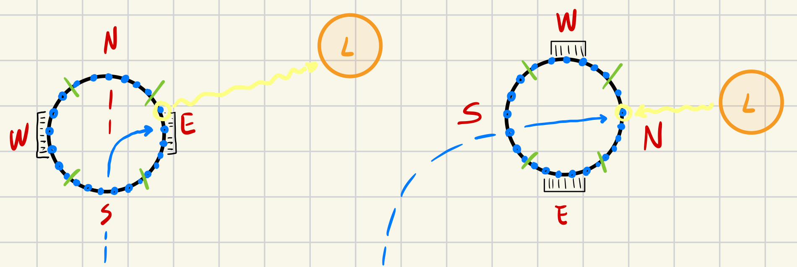

# Phototaxi Task
The main goal of this task was to develop a robot's behaviour, capable of guiding the robot towards a source of light that it positioned inside the arena. There are no requirements about how fast the robot has to go and what happens if the robot does not detect any light at all. Also there are no requirements in what the robot has to do when it reaches the source of light.
# Design
In order to achieve the task goal, I have developed the *phototaxi beahviour* in two different files. The first file, it is called *photo_logic* and contains the entire logic for guiding the robot towards the source of the light, then I have also developed another behaviour which is the *random walk* that is implemented inside the *move_random_logic*. I have decided to add the random walk because I have questioned my self what could happen if the robot does not detect any light at all. It will not move at all, so I have decided to inject the random walking only when the robot does not sense any light at all.



## PhotoTaxi
The phototaxi task, required the ability from the robot for detecting light in the arena. fortunately the robot is equipped with 24 light sensors, where each of them returns two different values:

1. *angle*: the angle of the sensor in radian
2. *value*: the amount of light that the sensor has detected, it is important to say that the range of value is [0, 1].

In order to use the light information from the sensors and guide the robot towards the source of light, I have divided the 24 sensors into 4 different groups, where each group has exactly 6 different sensors:

```lua
DIRECTIONS = {
	{ direction = direction_module.NORTH, sensors = { 3, 2, 1, 24, 23, 22 } },
	{ direction = direction_module.EAST, sensors = { 21, 20, 19, 18, 17, 16 } },
	{ direction = direction_module.SOUTH, sensors = { 15, 14, 13, 12, 11, 10 } },
	{ direction = direction_module.WEST, sensors = { 9, 8, 7, 6, 5, 4 } },
}
```
The the logic for searching where is the *maximum* amount of light among all this *group* was achieve by a function that takes in input the sensor's indexs and calculate the sum of all the light values. Then the *direction* with the maximum value will be used to guide the robot towards the source of light.

```lua
function detect_light_angle(robot)
	local brightest_value = 0.0
	local max_local_value = 0
	local direction = direction_module.VOID
	for i = 1, #DIRECTIONS do
		local pair = DIRECTIONS[i]
		local intensity, max_light = detect_light_intensity(robot, pair.sensors)
		if intensity >= brightest_value then
			brightest_value = intensity
			direction = pair.direction
			max_local_value = max_light
		end
	end
	DIRECTION = direction
	return max_local_value
end

function detect_light_intensity(robot, sensors)
	local intensity = 0
	local max_intensity = 0
	for i = 1, #sensors do
		local sensor = sensors[i]
		local light_value = (robot.light[sensor].value * 10)
		intensity = intensity + light_value
		max_intensity = math.max(max_intensity, light_value)
	end
	return intensity, max_intensity
end
```

Then given the direction of the source of light, it is possible to reach the source of light by setting the appropriate velocity in both of the wheels.

```lua
function move_robot(robot)
	local factor = 2
    -- ....
	if DIRECTION == direction_module.NORTH then
		robot.wheels.set_velocity(general_module.CURRENT_VELOCITY, general_module.CURRENT_VELOCITY)
	elseif DIRECTION == direction_module.SOUTH then
		robot.wheels.set_velocity(general_module.CURRENT_VELOCITY, -general_module.CURRENT_VELOCITY)
	elseif DIRECTION == direction_module.WEST then
		robot.wheels.set_velocity(0, general_module.CURRENT_VELOCITY)
	else
		robot.wheels.set_velocity(general_module.CURRENT_VELOCITY, 0)
	end
end
```

# Random Walk
As I said, it was important to add a logic that allows the robot to walk when there is no light at all, in order to achieve this goal I have deisgned a a random walk that is called only when there is no light around the robot. In order to achieve this goal I wanted to use a simple logic for the generation of this *behaviour*. So in order to stay as as simple as possible and in the meantime achieve the goal of *random walking*, I have used the *footbot random module*. More precisely, I have used the *uniform* method for automatically generate two different values inside the interval [0, 15]. Then both of this two values, where set as the velocities for the two wheels.

```lua
function moverandommodule.move(robot)
	local left_v = robot.random.uniform(0, generalmodule.MAX_VELOCITY)
	local right_v = robot.random.uniform(0, generalmodule.MAX_VELOCITY)
	robot.wheels.set_velocity(left_v, right_v)
end
```

