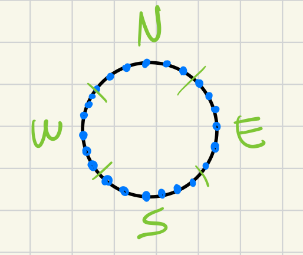
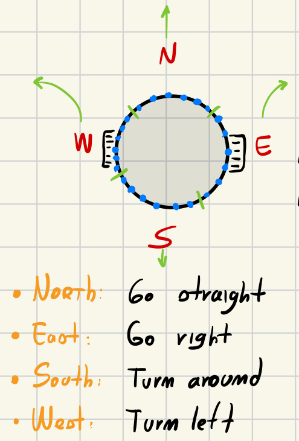

# Composite Behaviours
The main goal of this task was to develop a robot's behaviour capable of avoiding all the obstacles that are present inside the arena and in the mean time reach the source of light. There are no requirements in what the robot has to do when there is no light at all.

## Design
The entire behaviour of this task, is divided into three different logics, then each logic is implemented inside a specific file, in order to have a better encapsulation:

1. *avoid_logic*: inside this file is implemented the logic for avoiding the obstacles in the arena;
2. *photo_logic*: this file contains the logic for the phototaxi task;
3. *move_random_logic*: logic for random walking in the arena.

Because this assesment has no specifics about what the robot has to do when the robot does not detect any light at all, I have decided to add the random walking logic only when the robot detects not light and in the nearby there are not obstacles to avoid. This entire system works with a logic that can be categorized as a subclass of a *fuzzy logic*.

Each of this *file* exposes two different methods:

1. *sense*: search in the environment around the robot and decided if it has to do something;
2. *callback*: apply the main logic designed in the file (avoid the obstacle, go towards the light, random walk).

Inisde the controller I have designed the logic using a cascade of ifs, where starting from the most important task, the *collision avoidance*, we go down towards the *random walk*. Here is how It is implemented:

```lua
function step()
	if avoid_logic.sense(robot) then
		avoid_logic.callback(robot)
	elseif phototaxi.sense(robot) then
		phototaxi.callback(robot)
	else
		move_random_logic.callback(robot)
	end
end
```
By doing this I am able to alway perform the most *important* task every time, so in this case if there is an object the robot will always try to avoid it, then if there are no objects at all around the robot, It will search for the light and if no light is detected then the robot will start *move randomly* in the area until an obstacle is detected or better if the source of light has been detected.

### Obstacle Avoidance
In order to implement the *obstacle avoidance*, I have used a very simple logic, given all the 24 proximity sensors, I get the value with the *highest score* (it means that I get the closest sensor to an object), then I also save the *angle* of this sensor. By using the *angle*, then the robot is able to avoid the obstacle, by going towards the *opposite* direction. The *sense* method of this logic checks if there is an obstacle to avoid, it returns *true* if there is an obstacle otherwise *false*, then inside the *callback* method there is the actual logic for avoiding the detected obstacle, in this way each of the task is indipendent from all the others.

### PhotoTaxi

The phototaxi logic involved the use of the light sensors, more in particular I have grouped all the sensors into 4 different groups, where each one of the has exaclty 6 different sensors.



```lua
DIRECTIONS = {
	{ direction = direction_module.NORTH, sensors = { 3, 2, 1, 24, 23, 22 } },
	{ direction = direction_module.EAST, sensors = { 21, 20, 19, 18, 17, 16 } },
	{ direction = direction_module.SOUTH, sensors = { 15, 14, 13, 12, 11, 10 } },
	{ direction = direction_module.WEST, sensors = { 9, 8, 7, 6, 5, 4 } },
}
```


Then for each of the group the robot adds up all the sensor's values, then it will follow the direction that has the highest score. In this ways It is possible to reach for the light. The *sense* method of this logic checks if the robot detects some light in the arena, if it does then the *callback* method will apply the logic for moving the robot towards the direction with the highest score calculated in the *sense* method. It is important to say that this method and in particular the *sense* will be called only if the object detection task has not detect any object at all.



### Random Walk
The random walk logic follows a simple idea, using the *robot.random.uniform* I generate two different values, that will be then set as the left and right velocity of the wheels.
