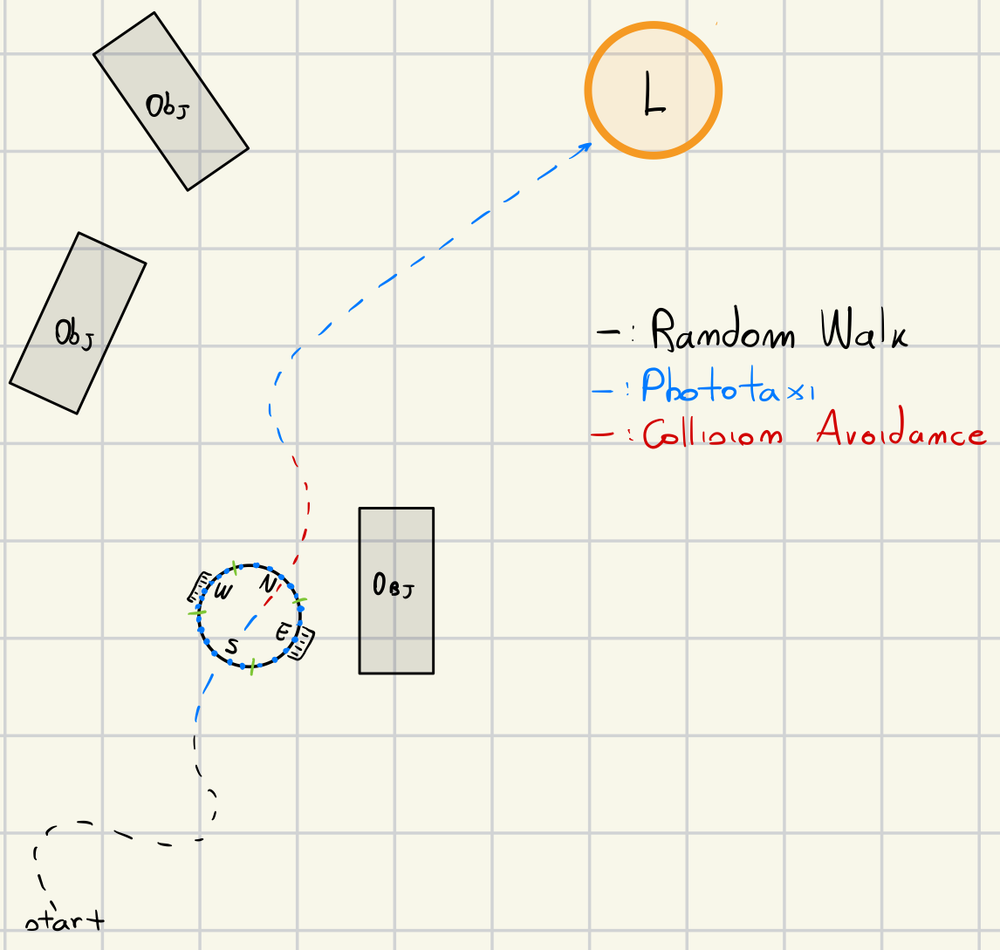

# Composite Behaviours
The robot is asked to find a light source and go towards it, while avoiding collisions with other objects, such as walls, boxes and other robots. The robot should reach the target as fast as possible and, once reached it, it should stay close to it (either standing or moving). For physical constraints the wheel velocity cannot exceed the value 15 (i.e., 15−2m/s).

## Design
The entire behaviour of this task, is divided into three different *logics*, each logic is implemented inside a specific file, in order to have a better *separation of concerns*:

1. *avoid_logic*: inside this file is implemented the logic for avoiding the obstacles in the arena;
2. *photo_logic*: this file contains the logic for the phototaxi task;
3. *move_random_logic*: logic for random walking in the arena.

Because this assesment has no specifics about what the robot has to do when the robot does not detect any light at all, it was necessary to add a *new behaviour* to the robot for walking whene there is no light at all or no objects are *detected*. In this way the robot always tries to seach for the light even when there is no light, this allows the robot to explore the arena.



Each of the *file* that implements a behaviour exposes two different methods:

1. *sense*: search in the environment around the robot and decided if it has to do something, this is related to its behaviour, for example if this method is called on the *phototaxi* logic, the robot will search for any light in the surrounding;
2. *callback*: apply the main logic designed in the file (avoid the obstacle, go towards the light, random walk).

### Composition of Different behaviours
Because the system has more behaviours that need to be joined and used together in different moments, each behaviour has its own priority:
1. *Priority Very High*: collision avoidance;
2. *Priority High*: phototaxi;
3. *Priority Low*: random walk.

In order to *execute* the behaviour with the highest priority, the controller is implemented using a cascade of *ifs*. The final result allows the robot to automatically decide what it has to do in a specific moment.

```lua
function step()
	if avoid_logic.sense(robot) then
		avoid_logic.callback(robot)
	elseif phototaxi.sense(robot) then
		phototaxi.callback(robot)
	else
		move_random_logic.callback(robot)
	end
end
```
By doing this the robot is able to alway perform the most *important* task every time, so in this case if there is an object the robot will always try to avoid it, then if there are no objects at all around the robot, it will search for the light and if no light is detected then the robot will start *move randomly* in the area until an obstacle is detected or better if the source of *light* has been detected.


### Obstacle Avoidance
In order to implement the *obstacle avoidance*, the robot uses the following logic: given all the 24 *proximity* sensors, the robot gets the sensor with the *highest value* (the higher the value the smaller the distance between the robot and the obstacle) and also the sensor's *angle*. By using the *angle*, the robot is able to avoid the obstacle, by going towards the *opposite* direction. The *sense* method of this logic checks if there is an obstacle to avoid, it returns *true* otherwise *false*, then inside the *callback* method there is the actual logic for avoiding the detected obstacle.

```lua
function avoid_object(robot, angle)
	if angle > 0 then
		robot.wheels.set_velocity(general_module.MAX_VELOCITY, 0)
	else
		robot.wheels.set_velocity(0, general_module.MAX_VELOCITY)
	end
end
```

### PhotoTaxi
The phototaxi logic involved the use of the light sensors, more in particular all the robot's sensors are grouped into 4 different groups, where each one of the has exaclty 6 different *sensors*.


```lua
DIRECTIONS = {
	{ direction = direction_module.NORTH, sensors = { 3, 2, 1, 24, 23, 22 } },
	{ direction = direction_module.EAST, sensors = { 21, 20, 19, 18, 17, 16 } },
	{ direction = direction_module.SOUTH, sensors = { 15, 14, 13, 12, 11, 10 } },
	{ direction = direction_module.WEST, sensors = { 9, 8, 7, 6, 5, 4 } },
}
```

Then for each of the group the robot adds up all the sensor's values, then it will follow the direction that has the *highest score*. In this ways it is possible to reach for the light. The *sense* method of this logic checks if the robot detects some light in the arena, if it does then the *callback* method will apply the logic for moving the robot towards the direction with the highest score calculated in the *sense* method. It is important to say that this method and in particular the *sense* will be called only if the object detection task has not detect any object at all.

```lua
function detect_light_intensity(robot, sensors)
	local intensity = 0
	local max_intensity = 0
	for i = 1, #sensors do
		local sensor = sensors[i]
		local light_value = (robot.light[sensor].value * 10)
		intensity = intensity + light_value
		max_intensity = math.max(max_intensity, light_value)
	end
	return intensity, max_intensity
end
```
The code provided above, has the main logic of adding up all the values detected from the light sensors. This operation will be done for all the different groups (which are 4 in total), then the group with the highest score will guide the robot towards the source of light.


```lua
function detect_light_angle(robot)
	local brightest_value = 0.0
	local max_local_value = 0
	local direction = direction_module.VOID
	for i = 1, #DIRECTIONS do
		local pair = DIRECTIONS[i]
		local intensity, max_light = detect_light_intensity(robot, pair.sensors)
		if intensity >= brightest_value then
			brightest_value = intensity
			direction = pair.direction
			max_local_value = max_light
		end
	end
	DIRECTION = direction
	return max_local_value
end
```


### Random Walk
The random walk logic follows a simple idea, using the *robot.random.uniform* I generate two different values, that will be then set as the left and right velocity of the wheels.
