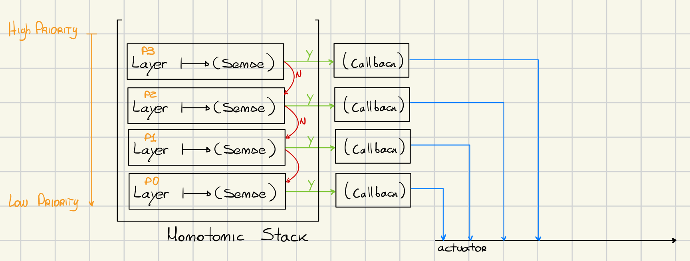
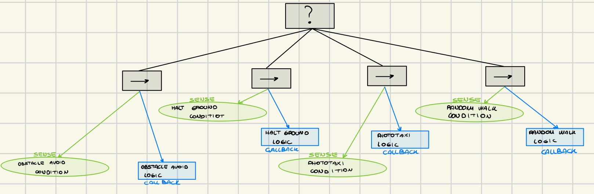

# Subsumption Architecture
The robot is expected to be able to find a light source and go towards it, while avoiding collisions with other objects, such as walls, boxes and other robots. The robot should reach the target as fast as possible and, once reached it, it should halt. A black spot underneath the light bulb identifies the halt region. It is important to say that there is nothing about what should happen where there is not light at all and no objects around the robot.

## Design
The overall design of the system was based on a layered architecture, where each behavior has its own *lua* file:
1. *avoid_logic*: contains the real logic for avoiding the obstacles;
2. *halt_logic*: contains the logic for stopping the robot when it is above a black spot;
3. *photo_logic*: contains the logic for going towards the source of the light;
4. *move_random_logic*: contains the logic for activate the random walk of the robot.

The design of all the different tasks use an Object Oriented philosophy, where every logic file exposes two main different *APIs*:
1. *sense*: with the using of this method the behaviour searches in the environment and decides if it has something to do (for example avoid an obstacle, going towards the light), this method returns *True* if it is necessary to call its *callback* otherwise it will return *False*.
2. *callback*: the second API, runs the *real logic* for a specific task, this must be run only if the *sense* method has returned True.

Because one of the requirement of this task was to develop the robot behaviour using the *subsumption architecture*, it was necessary to define all the different priorities over all the different tasks. Among all the possible combinations of behaviours, the chosen stack is this one:
1. Avoid Obstacle;
2. Halt Logic;
3. PhotoTaxi Logic;
4. Random Walk Logic.

In order to execute all the behaviours using the correct order of priority, inside the controller it is used a *decreasing monotonic* stack, where on top of the stack there is the logic with the *highest priority*.



As can be seen from the image, every time that the *sense* method returns false, the controller will automatically check a behaviour with a lower priority. When the *sense* method will return true, the *callback* method will be invoked, it will be executed its logic and then the execution of the exploration of the stack will be *interrupted* by using a *break*, in this way the robot is always able to run the most important task each time.

```lua
local photo_logic = require("photo_logic")
local avoid_logic = require("avoid_logic")
local move_random_logic = require("move_random_logic")
local halt_logic = require("halt_logic")

STACK = {
	move_random_logic, -- Priority 0
	photo_logic, -- Priority 1
	halt_logic, -- Priority 2
	avoid_logic, -- Priority 3
}
```

### Step Analysis
Each time the step method is called within the controller, the thread traverses the stack from top to bottom—that is, from the highest to the lowest priority. For each logic in the stack, the controller invokes the sense API. If sense returns true, the corresponding callback method is executed. This ensures that the robot performs the highest-priority logic available at that moment, after which the loop is terminated. If none of the logics are triggered, the robot defaults to executing a random walk.

```lua
function step()
	local override = false
	for i = #STACK, 1, -1 do
		local module = STACK[i]
		if module.sense(robot) then
			module.callback(robot)
			override = true
			break
		end
	end
	if not override then
		STACK[1].callback(robot)
	end
end
```

To be noticed, the random walk sense method always returns *true*, this is because it does not need specific conditions to run. Also if none of the behaviour has ran, the controller automatically ran the behaviours with the lowest priority.

### Observations: Behavioural Tree
This layered architecture really resemble a *behavioural tree*, because the controller executes the real behaviour of a node only when its status is true (in this case it means that the node has to do something), then the controller execute the code inside the node (by calling the *callback* method) and it will return. Instead if the *sense* method, which contains the *activation condition*, returns false the *controller* will step on the next most important behaviour to check and possibly execute it. By using this type of architecture I have noticed that the code is really well separated, and the fact of splitting the activation condition and the execution code in two different methods linked to a single behaviour really helps in to creating long chains of more complex mechanism in which a signle behaviour can be composed by multiple simple behaviours and so on (by following the *Divide et Conquer* method).

