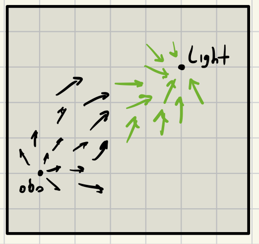
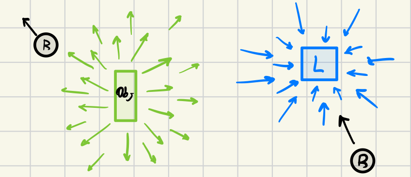

# Motor Schema Task
The robot is expected to be able to find a light source and go towards it, while avoiding collisions with other objects, such as walls, boxes and other robots. The robot should reach the target as fast as possible and, once reached it, it should stay close to it. In this task there are no specifications about what the robot should do when there is no light at all.

## Design
The main goal of this task was to develop the entire logic using *Motor Schemas*. The first thing that I did was to draw and imagine all the different forces that the robot will feel inside the arena. So by using this way of thinking I have split the forces into three different categories:
1. *attractive*: this type of force drag the robot towards it, the robot "likes" this type of force and it will try to go towards the source of this force;
2. *repulsive*: this type of force is the opposite of the *attractive* one, in this case the robot tends to avoid it by going towards the opposite direction of the force;
3. *random force*: this is a type of *attractive* force but its source changes every time, in this way there is not a single source of the force, but every time it changes.

The random force, it helps the robot in the situation in which the *attractive* force and *repulsive* force are not strong enough. I have also imagined that every force in the area depends on the distance, in this way I can regulate the amount of force that the robot feels. I have decided to set for the *phototaxi* task the *attractive* force, then for the *obstacle avoidance* the *repulsive* one and finally the *random walking* to the *random force*.



In order to keep this image as simple as possible I have avoided the *random force*.
I have developed three different files, with a single common API, *get_vector*, when this method is called, it returns a vector representing that specific type of force. In order to achieve the final goal I have divided the implementation of all the different behaviours in:
1. *attractive*: contains the vector with the attractive force;
2. *repulsive*: contains the vector with the repulsive force;
3. *random_force*: contains the vector with the random force.



The controller *step* calls the *get_vector* method of each file, sum all the vectors and call the *motor_schema* logic for moving the robot towards a direction.

```lua
function step()
	local v1 = attractive.get_vector(robot)
	local v2 = repulsive.get_vector(robot)
	local v3 = random.get_vector(robot)
	motor.move(robot, vector.vec2_polar_sum(v1, vector.vec2_polar_sum(v2, v3)))
end
```

There are also some utilities stored in:
1. *sensor_schema*: this file contains some utilities for creating a vector using different logics while working on the input sensors;
2. *angle_utils*: contains angle utilities for normalise an angle or returnig the opposite of an angle.

### Attractive Force
Because this task required the fact of developing the logic using the *motor schema* it was necessary to define the what so called *perception schema*, which is the *rule* used for generating the *vector schema*. For the perception schema I used the *highest* value among all the light sensors, then I create the vector using the angle of the sensor with the highest value and for what concerns the *length* of the vector I use the sensor's value combined with a formula (in this way I can module the amount of force that the robot feels based on the distance).

```lua
function perception.from_sensors(sensors, MAX_VALUE, thr, force)
    local best_angle = 0
    local max_value = 0.0
    for i=1, #sensors do
        local sensor = sensors[i]
        if sensor.value >= thr and max_value < sensor.value then
            max_value = sensor.value
            best_angle = sensor.angle
        end
    end
    local length = max_value + (max_value + force(max_value))-- ((MAX_VALUE - max_value) / MAX_VALUE) * force(max_value)
    return {angle=best_angle, length=length}
end
```

The formula that I have used for module the force, takes as input the distance from the source and based on this information it will increase the force.

```lua
function attractive.module_force(distance)
	if (distance >= 0.70) then
		return 1
	end
	return distance + 4
end
```

By using this formula the robot *accellerate* if it is far away from the source of the light and It will slow down when it is very close to it.

### Repulsive Force
For what concernes the *repulsive* force I have used the same *perception schema* of the attractive force, so given as input the *proximity* sensors (to the *sensor_schema* function) I store the sensor with the highest value and the angle of the sensor with the highest value. In this way I can create the vector using the same formula that was used for the attractive force. The main difference between the repulsive and the attractive force is that it is necessary to *invert* the angle, because the robot needs to avoid the obstacle by going towards the *opposite direction* of the sensor with the highest score, in order to do that I take the vector and I create a new vector with the opposite angle like so:

```lua
function repulsive.get_vector(robot)
	local vector = ps.from_sensors(robot.proximity, 1, 0.1, repulsive.module_force)
	return {angle=angle_utils.opposite(vector.angle), length=vector.length}
end

function repulsive.module_force(distance)
	if (distance >= 0.10) then
		return 4 + distance
	end
	return 1
end
```

Even in this case the formula for moduling the vector's length is based on the distance from the object itself, in this way if the robot is *very close* to the object it will *accellerate*.

### General idea for moduling the forces
The idea behind the *module_force* comes from the electromagnetic fields and particles theory, more in particular I have imagined the robot as a particle with a *polarity*, and all the forces generates *electromagnetic fields*. If the type of force is *attractive* it means that it has the *opposite* charge of the particle, instead if the force is *repulsive* the field has the *same polarity* of the particle. From the theory we know that the particle will *accellerate* based on the distance that the particle has from the source of the magnetic field and I tried to replicate this phenomenon using the *module_force* function. The formula that i have used is very simple, in this way the result can be still seen and for the robot itself will be much more easy reach its goal.

### Random Force
The last force that the robot feels is the random one, in this case I just create a random angle in radian and a random length in the interval [0, 1].

```lua
function random.get_vector(robot)
    local angle = angle_utils.normalise(math.random(0, 360) * (math.pi / 180))
    local vector = {angle=angle, length=math.random(0.0, 1.0)}
    return vector
end
```