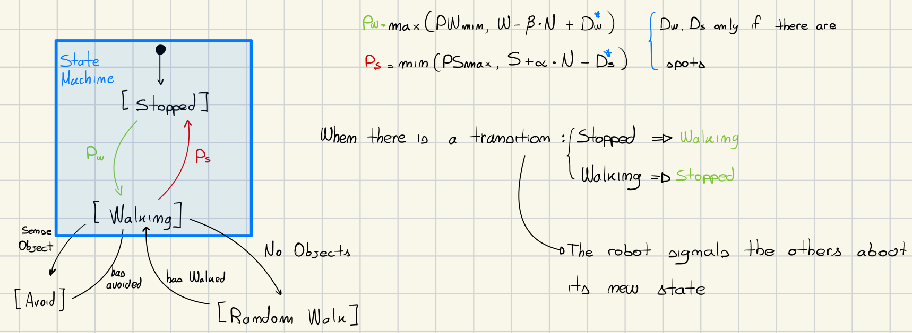

# Swarm Robotic
The goal of this exercise was to develop an *Aggregation Beheaviour*. Where a robot can be in two different states depending on specific conditions. The robot can be stopped and it can start moving by using a specific probability (Pw), and also if the robot is walking it can stop by using another probability (Ps). While the robot is walking it also has to *avoid* all the other robots nearby, and when there are not any other robots around it has to randomly walk in the arena. The probability of the robot to going from the status of *WALKING* to *STOPPED* depends on how many robots are stopped around a specifc arean from the robot, and the probability of the robot for going from *STOPPED* to *WALKING* depends on the number of robots that are currently walking around the current robot.

## Design
This excercise has a focus specifically on the *swarm robotic topic*. And I have divided the entire problem in different specifics. And all this specifics has the main goal of creating clusters of stopped robots. The first thing that I did was the creation of the Robot's State Machine:



There are two main states:
1. *Stopped*: this is the state where the robot does not move at all;
2. *Walking*: in this state the robot walks randomly inside the arena. while it tries to avoid all the other robots.

As can be seen from the image, when the robot is inside the *WALKING* state, it has to always avoid objects if detected, otherwise it randomly walk, it is important to say that every time the robot can fall in the *STOPPED* status. In order to achieve this behaviour, inside the step method the robot gets the probability for changing its state, if the robot can change then it will transition into the newer state.

```lua
function step()
    if currrent_state == states.STOPPED then
        local should_walk = probability.should_walk(robot, 0.01, 0.1)
        if should_walk then
            handle_walk()
        end
    elseif currrent_state == states.WALKING then
        local should_stop = probability.should_stop(robot, 0.1, 0.05)
        if should_stop then
            handle_stop()
        else
            walking()
        end
    end
end
```

In this way the robot every time tries to change its state thanks to the probabilty, both methods *should_walk* and *should_stop* returns a boolean, in this way if the probability is true, the robot has to change its state. The transition from the *Stopped* state to the *Walking* (and viceversa) is guided by two different probabilites:
1. *PS*: is the probability used by the robot for switching from *Walking* to *Stopped*;
2. *PW*: is the probability used by the robot for switching from *Stopped* to *Walking*.

### Design Signaling
As the task said, the robot must be able to communicate with its neighbours using the *range* and *bearing* technology. If the robot stops, then it will set the bit number 1 (the *channel*) to one, otherwise it will set the bit channel to zero, this means that the robot starts walking in the arena. This signaling logic *helps* the robot at generating the probabilities for possibly change its state.


The implementation of the *signaling* logic can be found in the *signal.lua*. Every function that can be found in this file, works only on one specific bit that is the *CHANNEL* bit.

```lua
function signal.start_moving(robot)
	robot.range_and_bearing.set_data(CHANNEL, WALKING)
end

function signal.stop_moving(robot)
	robot.range_and_bearing.set_data(CHANNEL, STOP)
end

function signal.count_status(robot, status)
	local robots = 0
	for i = 1, #robot.range_and_bearing do
		local neighbour = robot.range_and_bearing[i]
		if neighbour.range < MAX_RANGE and neighbour.data[CHANNEL] == status then
			robots = robots + 1
		end
	end
	return robots
end
```

When a single robot has to run the probability operation it needs to count the number of neighbours in a specific state, in order to do that I have implemented the method *count_status*, that counts the number of robot in a specific range (*MAX_RANGE*) in a given *status*. The MAX_RANGE is a constant set to 30 cm.


### Design Probability
The probability is *driven* by the number of all the other robots in a specific state, in order to do that every time the robot *checks* for the probability it will also *count* the states of all its *neighbours* (in a given range). So in this way the robot will be able to rescale its *probability*.  Both probabilities depends on the number of the other robots in a given state, for example every time the robot tries to *stop*, it will count the number of robots around it that are currently *stopped*, the higher the number and the higher the probability for the robot to stop, the same goes for the *walking* transition. For what concernes the *second exercise* the probability is also guided by the *ground color*, if the ground color is black then the robot will try more often to stop.

Every method in this file follows the same structure:
1. *count phase*: count the number of neighbours in a specific state;
2. *apply*: apply the input probability formula, then compare this value with a random generated value;
3. *ground color* (optional): get the ground color under the robot and use this value in the probability formula (this is only done in the exercise number 2).

```lua
-- Ex 1
function probability.should_stop(robot, S, alpha)
	local total_stopped = signal.count_stopped(robot)
	return probability.apply(math.min(PS_max, (S + alpha * total_stopped)))
end

-- Ex 2
function probability.should_stop_with_spot(robot, S, alpha)
	local color = ground.detect_ground_color(robot)
	return probabilit.should_stop(S - color, alpha)
end

function probability.apply(prob)
	local t = robot.random.uniform()
	return t <= prob
end
```

### Random Walking
For this task I have decided to implement a new version for the *random walking*, my new version works with this logic:
1. Choose a direction (left, right), the angle is choosen by using a random boolean, if it is true then the robot turns left otherwise it turns right;
2. Choose a number of steps to do in a direction;
3. Walk until the number of steps done is equal to the number of total steps to do, then start again on the point number 1.

```lua
function move_r.walk_randomly(robot)
	if steps <= 0 then
		local angle = math.random(0, 1)
		steps = math.random(1, 20)
		move_r.turn(robot, angle)
	else
		steps = steps - 1
		move_r.go_straight(robot)	
	end
end
```

This new version of the random walk allows the robot to cover an area much more dense, by picking a direction and going into a direction for a number of random steps.

---
### Possible Design for Excercise 3
The goal of the third exercise is to cluster all the robots into one single spot. My general idea is to use along with the already use channel 1, another channel, we call it 2. This channel is used to store the total number of stopped robots detected from each robot. In this way each robot can ask and get the number of total robots stopped that are detected from all the neighbouring robots. Then if one of values that are get from this channel is greather than the one calculated from the current robot, this will trigger the random walking of the robot. The goal then is to cluster all the robots in one single dot, in order to do this, when a robot starts walking it will use a greedy approach in which it will always chose the direction that maximise the number robots detected in the second channel, so the angle it will always be adjusted using the number of total robots detected from the second channel.

#### Greedy Proof

##### 1. Problem Formalization

- **Environment**: A bounded space where `n` robots can move.
- **Objective**: All robots should eventually cluster into a single location (or a small area within ε-distance).
- **Sensing/Communication**:
  - **Channel 1**: status of the nearby robot (*WALKING* or *STOPPED*).
  - **Channel 2**: Each robot broadcasts the number of stopped robots it can perceive. This allows other robots to estimate where clusters are forming.
- **Behavior**:
  - A robot begins **random walking** if it detects that some neighbor sees more stopped robots than it does.
  - It then chooses the direction that **maximizes** the number of stopped robots (as indicated by values from Channel 2).
  - This is a **greedy strategy**: always move in the direction of greatest local density.

##### 2. Greedy Algorithm Intuition

- At each step, a robot chooses the **locally optimal direction** — the one with the highest reported number of stopped robots.
- It does not compute a global plan but acts **myopically**, based on immediate perceived gain.
- This behavior mirrors classic greedy algorithms: *always make the best immediate move*.

##### 3. Proof That Greedy Works

We aim to show that this greedy movement leads all robots to converge to a single cluster.

###### Step 1: Define a Potential Function

Let:
$$\Phi = \sum_{i=1}^n \text{distance}(r_i, c)$$

Where:
- $r_i$ is the position of robot \( i \),
- \( c \) is the center of the current cluster (e.g., center of mass or mode of stopped robots).

###### Step 2: Show Monotonic Decrease

- When a robot moves greedily toward a region of higher robot density (based on Channel 2), it moves closer to the cluster center.
- Therefore, its distance to \( c \) decreases.
- As a result, the potential function \( \Phi \) strictly **decreases**.

###### Step 3: Show Convergence

- The potential function $\Phi$ is **bounded below by 0** (all robots in the same position).
- Since $\Phi$ decreases with each greedy movement, and is bounded, it must **converge**.
- Once no robot sees a higher value in Channel 2 elsewhere, movement stops — this is a **stable global cluster**.

###### Step 4: No Local Minima Trap

- Channel 2 creates a "density field" that acts like a **pheromone gradient**.
- Greedy robots always move toward denser regions — they can't get stuck in false local optima.
- As more robots stop in a location, the gradient becomes steeper, reinforcing the correct clustering behavior.

Thus, greedy behavior leads to all robots clustering at a single location.